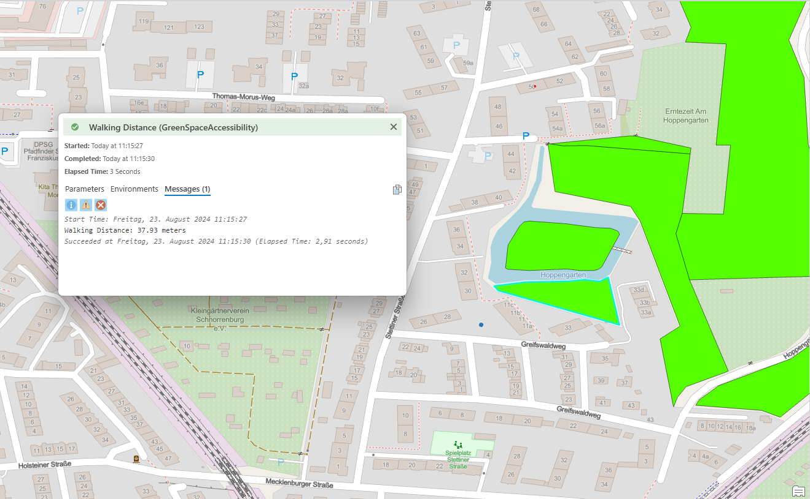
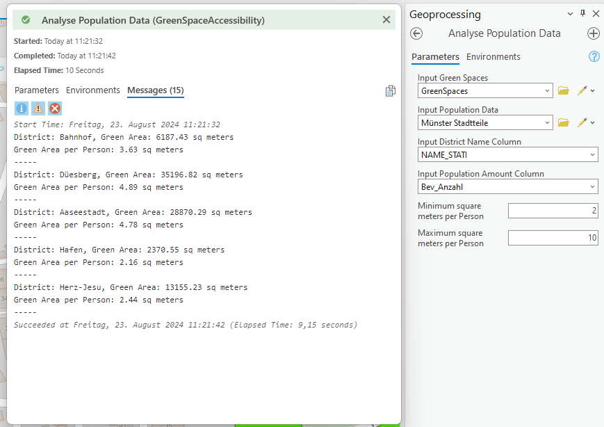
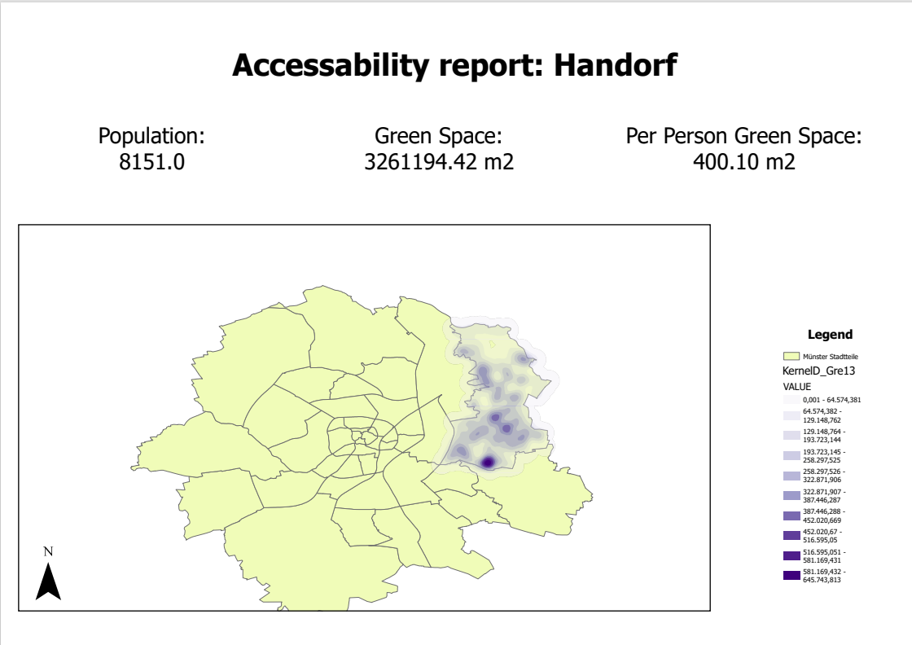
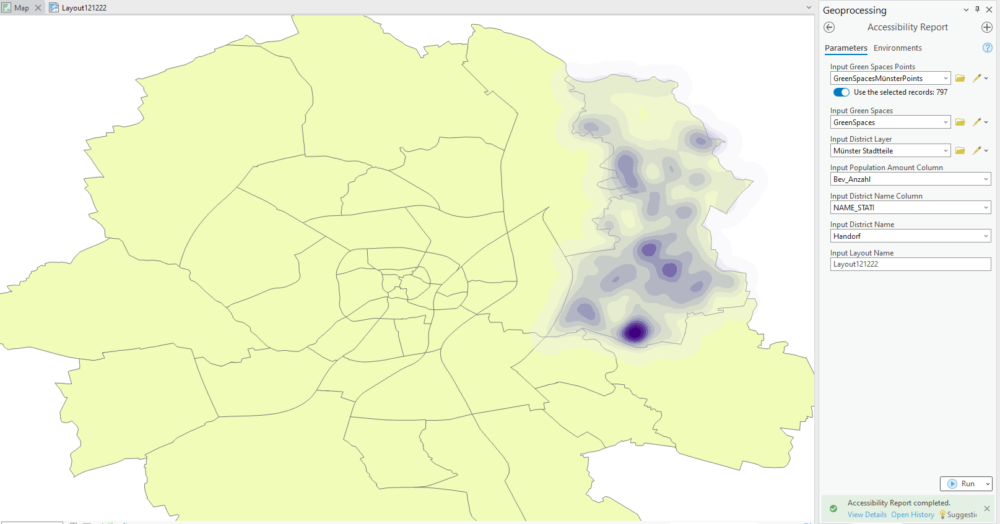

# Green Space Accessibility Toolbox

This toolbox was created as the final assignment for the course "Python in QGIS and ArcGIS" by Hendrik Lüning and Maximilian Elfers.

This ReadMe gives information about what each Tool does, what data is needed as well as information about the provided data.
 
 
 

## Provided data

There are 4 datasets provided in this zip.

**Münster Stadtteile:** This dataset contains the districts of Münster. We added information about the population of each district our self (source: https://www.stadt-muenster.de/statistik-stadtforschung/zahlen-daten-fakten)

**Green Spaces Münster:** This dataset contains all green spaces in the area of Münster. The dataset was altered by us to only contain green spaces to contain data of Münster (source: https://opendata.stadt-muenster.de/dataset/openstreetmaps-rohdaten-f%C3%BCr-m%C3%BCnster)

**Green Spaces Münster Points:** This dataset was created from the "Green Spaces Münster" dataset using the "Feature To Point"-Tool

**Report Layout:** This layout is used to print the accessibility report.
 
 
 

## Data needed for the Tool

There are 3 (4) datasets needed to use all tools. 

**District layer:** This layer needs to be a Feature Set (polygon) that also contains population data 

**Green Space layer:** This layer needs to be a Feature Set (polygon) that contains data about green spaces 

(Optional) **Green Space point layer:** This layer needs to be a point layer of the "green space layer". This can either be a different layer or can be created in ArcGIS Pro using the "Feature To Point"-Tool.

**Report Layout:** This Layout needs to contain four text fields with the names *Accessibility report:*, *Population:*, *Green Spaces:* and *Per Person Green Space:*, as well as a map with the name *WEBMAP_MAP_FRAME*. Other than that the layout can be created individually.
 
 
 

## Get Started

Please load all the provided data onto the map.  
This also contains the layout, be aware of the name of the layout as it is shown on the top register where you can switch between the map and the layout (this name is later needed)  
Now you can start with any tool of your liking. 

*Be aware:* Some of the provided data can be false which can lead to wrong results as this data is used to demo the tools.
 
 
 

## Walking Distance - Tool

### Description
This Tool calculates the distance from a selected position on the map to the nearest green space.

### Parameters
**Input Point:** The "starting" point from where to calculate  
**Input Green Spaces:** The **Green Space layer**  
**Input Green Space ID Field:** The column name of the ID field of the **Green Space layer**  

### Output
The output is a message in the tool console naming the distance as well as the selection of the nearest green space on the map.  

### Idea of the Tool
The user can find out what green space is nearest and get an idea of the distance.
 
 
 

## Analyse Population Data - Tool

### Description
This tool calculates the green space area and the per-person green space area for each district.

### Parameters
**Input Green Spaces:** The **Green Space layer**  
**Input Population Data:** The **District layer**  
**Input District Name Column:** The column of the district names of the **District layer**  
**Input Population Amount Column:** The column of the district population amount of the **District layer**  
**Minimum square meters per Person:** The minimum amount of per person green space area a district should have to be displayed  
**Maximum square meters per Person:** The maximum amount of per person green space area a district should have to be displayed  

### Output
The outputs are messages in the tool console showing the (per person) green space area for each district that fits the criteria.  

### Idea of the Tool
The user can analyze the different districts based on per-person green area space, as this can give an idea of the number of local recreation areas for each district.
 
 
 

## Accessibility Report - Tool

### Description
This tool creates a PDF report about the selected district containing (per person) green space area and population data, as well as a map with a heatmap of the green space distribution in the district.

### Parameters
**Input Green Spaces Point:** The **Green Space point layer**  
**Input Green Spaces:** The **Green Space layer**  
**Input District Layer:** The **District layer**  
**Input Population Amount Column:** The column of the district population amount of the **District layer**  
**Input District Name Column:** The column of the district names of the **District layer**  
**Input District Name:** The name of the district a report should be created about  
**Input Layout Name:** The name of the layout (see **Get started**)  

### Output
The output is a PDF file, as well as a heatmap that is loaded onto the map.

### Idea of the Tool
The user can create an accessibility report about a certain district for further use. The idea is to first use the **Analyse Population Data - Tool** to find a district that seems interesting and then create a report about it.
